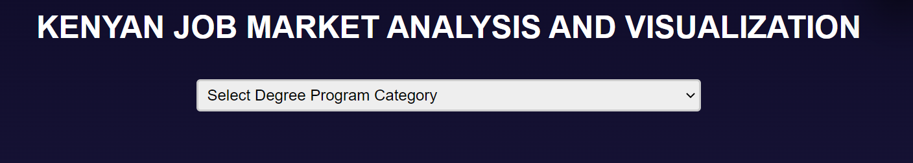

# KENYA LABOR MARKET ANALYSIS AND VISUALIZATION
=============================================

This project scraped data from  [JobswebKenya](https://jobwebkenya.com/) a job listing platform.
The data was then written to a csv file jobswebdata.csv.The data is then cleaned using Python and visualized in a website using Chart.js. To view the visualized data, you must register to the system.

## Features

- Scrapes data from a website using Beautifulsoup
- Data Is written to a csv file
- Data cleaning to remove duplicates and null values and other unwanted characters
- Analysis of the data to determine t gain insight of the labor market
- Visualizes analysed data in a website using Chart.js
- Access control using Firebase Authentication

## Installation
-Clone the repository
-If you want to update the csv file, run the jobsweb.py file. Ensure python and Beautiful soup is -installed before running the files.Run the jobswebClean.py to clean the data.
-To view the visualized data, run the index.html file in the browser.
-If the authentication is not working, update firebase config files in firebase_signup_login.js file -as well as logout.js.

## Usage
To use the system, register to the system. You will be redirected to the home page.If you already have an account log in to the system to view the visualized data.

Once logged in select the job categgory you want to view trends on. The data will be visualized in a chart.

